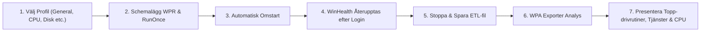

# WinHealth Diagnostic Hub & Performance Profiler

[-blue.svg)](#systemkrav--f%C3%B6ruts%C3%A4ttningar)
[](https://wails.io)
[](https://vitejs.dev)
[-critical.svg)](#k%C3%B6ra-winhealth)

**WinHealth** är ett modernt, högpresterande och heltäckande systemdiagnostik-, prestandaprofilerings- och åtgärdsverktyg utvecklat för Windows 10 och Windows 11. Applikationen är skapad för IT-tekniker, supportspecialister, systemadministratörer och avancerade användare som snabbt behöver identifiera felkällor, analysera långsamma uppstarter, diagnosticera Check Point VPN, läsa ut BSOD-kraschdumpar, övervaka hårdvara och åtgärda vanliga Windows-problem med ett enda klick.

All diagnostik sker lokalt på maskinen med omedelbar presentation i ett modernt grafiskt gränssnitt, samt möjlighet till export som interaktiv HTML-rapport eller strukturerad JSON.

---

## Innehållsförteckning

- [Huvudfunktioner](#huvudfunktioner)
  - [1. Samlad Hälsopoäng & Topp-problem](#1-samlad-h%C3%A4lsopo%C3%A4ng--topp-problem)
  - [2. Check Point Endpoint Security & VPN](#2-check-point-endpoint-security--vpn)
  - [3. Hårdvara & S.M.A.R.T.-lagring](#3-h%C3%A5rdvara--smart-lagring)
  - [4. Nätverk, DNS & Anslutning](#4-n%C3%A4tverk-dns--anslutning)
  - [5. Säkerhet, BitLocker & Windows Update](#5-s%C3%A4kerhet-bitlocker--windows-update)
  - [6. Krascher, BSOD & Minidumps](#6-krascher-bsod--minidumps)
  - [7. Prestanda, Processer & Resurser](#7-prestanda-processer--resurser)
  - [8. Uppstart, Inloggning, GPO & Djupgående WPR-bootspårning](#8-uppstart-inloggning-gpo--djupg%C3%A5ende-wpr-bootsp%C3%A5rning)
  - [9. Snabbåtgärder (One-Click Quick Fixes)](#9-snabb%C3%A5tg%C3%A4rder-one-click-quick-fixes)
  - [10. HTML- & JSON-rapportering](#10-html--och-json-rapportering)
- [Djupgående Boot-spårning (WPR & WPA Exporter)](#djupg%C3%A5ende-boot-sp%C3%A5rning-wpr--wpa-exporter)
- [Systemkrav & Förutsättningar](#systemkrav--f%C3%B6ruts%C3%A4ttningar)
- [Kom igång & Köra WinHealth](#kom-ig%C3%A5ng--k%C3%B6ra-winhealth)
- [Utveckling & Bygginstruktioner](#utveckling--bygginstruktioner)
- [Projekt- & Kodstruktur](#projekt--och-kodstruktur)
- [Säkerhet & Integritet](#s%C3%A4kerhet--integritet)

---

## Huvudfunktioner

### 1. Samlad Hälsopoäng & Topp-problem
- **System Health Score (0–100)**: En dynamiskt viktad poängalgoritm som väger samman hårdvaruhälsa, loggfel, nätverksprestanda, säkerhetsstatus, uppstartstid och eventuella VPN-avvikelser.
- **Kategoriserade problem**: Omedelbar översikt över kritiska fel, varningar och godkända moduler.
- **Snabbknappar för åtgärder**: Direktlänkade åtgärdsknappar för att lösa identifierade fel direkt från översikten.

### 2. Check Point Endpoint Security & VPN
- **Klientidentifiering**: Detekterar automatiskt installerad klientversion, binärsökvägar och konfigurationsfiler (`trac.config` m.fl.).
- **Tjänsteövervakning**: Realtidsstatus för Check Point-specifika tjänster (`TrAcSrv`, `CPNetServices`, `cp_ep_agent` etc.).
- **Virtuella nätverkskort**: Kontroll av `CPVNA`- och Securemote-adaptrar, MTU-storlek, IP-tilldelning och länkstatus.
- **Gateway-anslutningstest**: Automatisk ping och TCP-latensmätning mot konfigurerade VPN-gateways.
- **Felloggsanalys**: Hämtar och filtrerar ut de senaste felmeddelandena direkt från klientens loggfiler.
- **VPN Quick Fix**: Startar om alla Check Point-tjänster, avbryter hängande processer och återställer den virtuella adaptern med ett klick.

### 3. Hårdvara & S.M.A.R.T.-lagring
- **Processor & Minne**: CPU-modell, kärnor, realtidsbelastning samt totalt/använt RAM-minne.
- **Diskar & S.M.A.R.T.**: Identifierar mediatyper (NVMe, SSD, HDD), filsystem, ledigt utrymme och avläser S.M.A.R.T.-hälsostatus (prediktiva diskfel).
- **Batteridiagnostik**: Kontroll av batterihälsa (designkapacitet vs full laddningskapacitet i mWh), laddningscykler och aktuell laddningsnivå.
- **Moderkort & BIOS**: Visar moderkortsmodell, tillverkare och installerad BIOS-version.

### 4. Nätverk, DNS & Anslutning
- **Internet- och Gateway-kontroll**: Verifierar internetaccess och mäter svarstid (latens i ms) till standardgateway.
- **DNS Server Benchmark**: Testar tillgänglighet och svarstider för alla aktiva DNS-servrar.
- **Nätverkskort (NIC)**: Fullständig översikt över fysiska och virtuella nätverkskort, IP-adresser, nätmasker, MAC-adresser och länkhastighet (Mbps/Gbps).
- **Winsock & Proxy**: Identifierar trasiga Winsock-kataloger och felkonfigurerade HTTP/HTTPS-proxies.

### 5. Säkerhet, BitLocker & Windows Update
- **Antivirus & Skydd**: Läser av aktivt antivirussystem (Windows Defender eller tredjepart), realtidsskydd och definitionsålder.
- **BitLocker-kryptering**: Kontrollerar krypteringsstatus och skyddsstatus för samtliga anslutna volymer.
- **Windows-brandvägg & UAC**: Kontroll av brandväggens profiler samt UAC-nivå (User Account Control).
- **Windows Update-hanterare**:
  - Detaljerad lista över väntande uppdateringar med KB-artikelnummer och kategorier.
  - Senaste söktid och installationstid för uppdateringar.
  - **Dölj / Visa uppdateringar**: Möjlighet att dölja problematiska uppdateringar (så att Windows inte installerar dem) eller återaktivera dolda uppdateringar.

### 6. Krascher, BSOD & Minidumps
- **Minidump-analys**: Skannar automatiskt `C:\Windows\Minidump` efter BSOD-kraschdumpar.
- **Kraschorsaker**: Läser ut Bugcheck-koder och identifierar orsakande drivrutiner eller moduler.
- **Windows Händelseloggar**: Filtrerar och sammanställer kritiska systemhändelser (Kernel-Power, WHEA-Logger) samt applikationskrascher från Event Viewer.

### 7. Prestanda, Processer & Resurser
- **Resurskrävande processer**: Topplistor över processer med högst CPU- och minnesförbrukning med tillhörande PID och användare.
- **Autostartprogram**: Identifierar uppstartsprogram från Register, Startup-mappar och Schemaläggaren, med beräknad prestandapåverkan (High/Medium/Low).
- **Aktivera / Inaktivera Autostart**: Slå på eller av specifika autostartprogram direkt i gränssnittet.

### 8. Uppstart, Inloggning, GPO & Djupgående WPR-bootspårning
- **Tidsmätning av uppstartssekvens**:
  - Total uppstartstid (Total Boot Duration).
  - BIOS- och Kernel-fas (MainPath Boot).
  - Inloggnings- och profilladdningsfas (User Logon Wait).
  - Skrivbordsstabilisering (Post-Boot Delay).
  - Identifiering av Fast Startup (snabbstart).
- **Domän & Inloggningsserver**: Visar domäntillhörighet och aktiv inloggningsserver (Domain Controller).
- **Gruppolicy-mätvärden (GPO CSE)**: Mäter tidsåtgång och status för varje enskild Client-Side Extension (Scripts, Folder Redirection, Security, Drive Maps).
- **Onåbara nätverksresurser**: Upptäcker och testar automatiskt nätverksenheter, omdirigerade mappar, skrivare och domänkontrollanter som orsakar långa inloggningshängningar på grund av SMB/TCP-timeouts.
- **Avancerad Autoruns (30+ platser)**: Djupgående skanning inspirerad av Sysinternals Autoruns över Winlogon, BootExecute, Shell Extensions, Services, Drivrutiner och Schemalagda aktiviteter, inklusive digital signaturverifiering (`Authenticode`).
- **GPO HTML-rapport**: Generera och öppna en fullständig Group Policy Result-rapport (`gpresult /h`) med ett klick.
- **WPR ETW Boot-profilering**: Integrerad Windows Performance Recorder-spårning med automatisk omstart, RunOnce-återupptagning och WPA Exporter-analys.

### 9. Snabbåtgärder (One-Click Quick Fixes)
WinHealth innehåller kraftfulla inbyggda åtgärdsskript som körs säkert och loggar resultatet:

| Åtgärd | Beskrivning |
|---|---|
| **Återställ Check Point VPN** | Stoppar VPN-tjänster, avslutar låsta processer, startar om det virtuella nätverkskortet och återstartar tjänsterna. |
| **Återställ Nätverk, DNS & Winsock** | Rensar DNS-cachen (`ipconfig /flushdns`), återställer Winsock-katalogen och återställer TCP/IP-stacken. |
| **Rensa Temporära Filer** | Rensar säkert filer i `%TEMP%`, `C:\Windows\Temp` och `SoftwareDistribution\Download`. |
| **Återställ Windows Update** | Stoppar uppdateringstjänster (`wuauserv`, `bits`, `cryptsvc`), rensar cachen i SoftwareDistribution och startar om tjänsterna. |
| **Kör System File Checker (SFC)** | Startar en fullständig systemfilsreparation via `sfc /scannow` i bakgrunden. |
| **Dölj/Visa Windows Update** | Döljer eller visar valda uppdateringar via Windows Update API. |
| **Hantera Autostart** | Aktiverar eller inaktiverar program i Windows autostartregister. |

### 10. HTML- och JSON-rapportering
- **Interaktiv HTML-rapport**: Exportera en heltäckande, fristående och snyggt designad HTML-rapport med mörkt/ljust tema, grafer, färgkodade badges och tabeller – perfekt för att skicka till supporten eller arkivera.
- **Strukturerad JSON**: Exportera alla rådata och diagnostiska mätvärden till JSON för integration i övervakningssystem eller vidare skriptautomation.
- **Inbyggd filväljare**: Standard Windows Save File Dialog för smidigt val av sparmål.

---

## Djupgående Boot-spårning (WPR & WPA Exporter)

WinHealth har ett avancerat, inbyggt arbetsflöde för att diagnosticera långsamma uppstarter på djupet via Windows Event Tracing (ETW):



### Hur det fungerar:
1. **Konfiguration**: Användaren väljer profil (t.ex. *General*, *General (Verbose)*, *CPU*, *Disk I/O* eller *Network*).
2. **Schemaläggning**: WinHealth initierar `wpr.exe -start <profil> -filemode -recordtemptofile` och registrerar en `RunOnce`-nyckel i registret.
3. **Omstart**: Datorn startas om (med 10 sekunders nedräkning och möjlighet att avbryta).
4. **Återupptagning**: Efter inloggning startar WinHealth automatiskt och upptäcker den aktiva inspelningen.
5. **Analys**: När inspelningen stoppas sparas en unik `.etl`-fil. Om **WPA Exporter** finns installerat extraheras CPU-tider för processer, drivrutinsladdningstider och tjänstetider automatiskt.
6. **Fallback & Källangivelse**: Om WPA Exporter saknas kompletteras analysen från Windows Event Logs inom den uppmätta boot-sessionen (t.ex. nätverks-, domän-, DNS-, SMB- och GPO-fel). WinHealth anger alltid tydligt källan för mätdata och hittar aldrig på värden.

> [!NOTE]
> **Windows Performance Toolkit (WPT / WPA Exporter)**
> WPA Exporter (`wpaexporter.exe`) och WPA (`wpa.exe`) ingår i **Microsoft Windows Performance Toolkit (WPT)**, som är en del av kostnadsfria Windows ADK.
> På grund av Microsofts licensvillkor får dessa verktyg inte omfördelas inuti WinHealth.
> WinHealth känner automatiskt av om WPT finns installerat i standardsökvägarna (`C:\Program Files (x86)\Windows Kits\10\Windows Performance Toolkit` m.fl.). Om WPT saknas finns en direktknapp i gränssnittet som öppnar [Microsofts officiella ADK-installationsguide](https://learn.microsoft.com/windows-hardware/get-started/adk-install).

---

## Systemkrav & Förutsättningar

| Krav | Beskrivning |
|---|---|
| **Operativsystem** | Windows 10 eller Windows 11 (64-bit). |
| **Behörighet** | **Administratörsrättigheter** krävs för djup diagnostik, WPR-spårning, SFC-körning och åtgärder. |
| **PowerShell** | PowerShell 5.1 eller senare (inbyggt i Windows 10/11). |
| **WPT (Valfritt)** | Microsoft Windows Performance Toolkit (ingår i Windows ADK) för automatisk ETL-filanalys. |

---

## Kom igång & Köra WinHealth

### Köra den färdiga applikationen
1. Ladda ner eller hämta `WinHealth.exe`.
2. Starta applikationen med administratörsrättigheter:
   - Högerklicka på `WinHealth.exe` och välj **Kör som administratör**, *eller*
   - Dubbelklicka på medföljande **`Kör-WinHealth.bat`** (startar automatiskt med UAC-prompt).
3. Klicka på **Skanna datorn** i det övre högra hörnet för att starta en fullständig diagnos.

---

## Utveckling & Bygginstruktioner

WinHealth är byggt med **Go** i backend och **Wails v2** med **TypeScript / Vite** i frontend.

### Förutsättningar för utvecklare
- [Go](https://go.dev/dl/) (version 1.21 eller senare)
- [Node.js](https://nodejs.org/) (version 18 eller senare) och `npm`
- [Wails CLI v2](https://wails.io/docs/gettingstarted/installation):
  ```powershell
  go install github.com/wailsapp/wails/v2/cmd/wails@latest
  ```

### Köra i utvecklingsläge (Live Development)
För att köra med hot-reload av frontend och aktiv Go-koppling:
```powershell
wails dev
```
*Frontend-servern körs via Vite och öppnar applikationsfönstret. Du kan även ansluta via webbläsare på `http://localhost:34115` för devtools.*

### Bygga produktionsbinär
För att kompilera en fristående och optimerad `WinHealth.exe`:

**Alternativ 1 – Använd byggskriptet:**
```powershell
.\bygga.bat
```

**Alternativ 2 – Bygg manuellt med Wails CLI:**
```powershell
wails build -o WinHealth.exe
```
Den färdiga binären sparas i `build/bin/WinHealth.exe` och kopieras till rotmappen.

---

## Projekt- & Kodstruktur

```
friendly-galileo/
├── app.go                      # Wails Backend API (metoder som exponeras mot frontend)
├── main.go                     # Applikationsstartpunkt och Wails-konfiguration
├── wails.json                  # Wails projektkonfiguration
├── bygga.bat                   # Byggskript för produktion
├── Kör-WinHealth.bat           # Hjälpskript för att starta med administratörsrättigheter
│
├── pkg/
│   ├── models/
│   │   └── models.go           # Gemensamma datastrukturer, DTOs och rapportmodeller
│   │
│   ├── collectors/             # Diagnostiska datainsamlare (Go + PowerShell/ETW)
│   │   ├── engine.go           # Samordnare för parallell diagnoskörning och poängberäkning
│   │   ├── checkpoint.go       # Check Point VPN & Endpoint Security diagnos
│   │   ├── hardware.go         # Hårdvara, CPU, RAM, Disk, S.M.A.R.T. och batteri
│   │   ├── network.go          # Nätverkskort, Gateway, DNS-tester och Winsock
│   │   ├── security.go         # Antivirus, BitLocker, Brandvägg och Windows Update
│   │   ├── eventlogs.go        # BSOD-minidumpar och händelseloggar
│   │   ├── performance.go      # Topp-processer och grundläggande autostart
│   │   ├── integrity.go        # Enhetshanterarfel, Temp-filer och väntande omstart
│   │   ├── boot_analyzer.go    # Uppstartsmätning, GPO-analys och onåbara resurser
│   │   ├── advanced_boot.go    # WPR-styrning, RunOnce, 30+ Autoruns-kategorier & gpresult
│   │   ├── wpr_analysis.go     # ETL-parsning via WPA Exporter och händelsekorrelation
│   │   └── exec_util.go        # Körning av dolda PowerShell-kommandon med timeouts
│   │
│   ├── remediation/
│   │   └── fixes.go            # Snabbåtgärder (VPN-reset, DNS/Winsock-reset, temp-rensning m.fl.)
│   │
│   └── report/
│       └── html_report.go      # Generering av interaktiva HTML- och JSON-rapporter
│
└── frontend/                   # Web-baserad användargränssnitt
    ├── index.html              # HTML-skelett med moderna Google Fonts (Plus Jakarta Sans m.fl.)
    ├── src/
    │   ├── main.ts             # Frontend-logik, fliknavigering, datavisning & interaktioner
    │   ├── style.css           # Modern mörk design med glassmorphism, badges och kort
    │   └── app.css             # Generella layoutregler
    └── wailsjs/                # Autogenererade TypeScript-bindings till Go-metoder
```

---

## Säkerhet & Integritet

- **100 % Lokal exekvering**: Inga mätvärden, loggar, hårdvaruinformation eller systemdata skickas någonsin till externa servrar eller molntjänster.
- **Skonsamma åtgärder**: Samtliga inbyggda snabbåtgärder är utformade för att återställa felande tjänster och cacher utan att modifiera eller radera användardata.
- **Transparent källangivelse**: Alla rapporterade data deklarerar tydligt vilken källa som använts (t.ex. WPA Exporter ETL-data vs Windows Event Log fallback).

---

## Licens & Information

Detta projekt är utvecklat med Go, TypeScript och Wails. För information om licenser för ingående tredjepartskomponenter, se [`THIRD_PARTY_NOTICES.md`](file:///c:/Users/Sebastian/Documents/antigravity/friendly-galileo/THIRD_PARTY_NOTICES.md).
